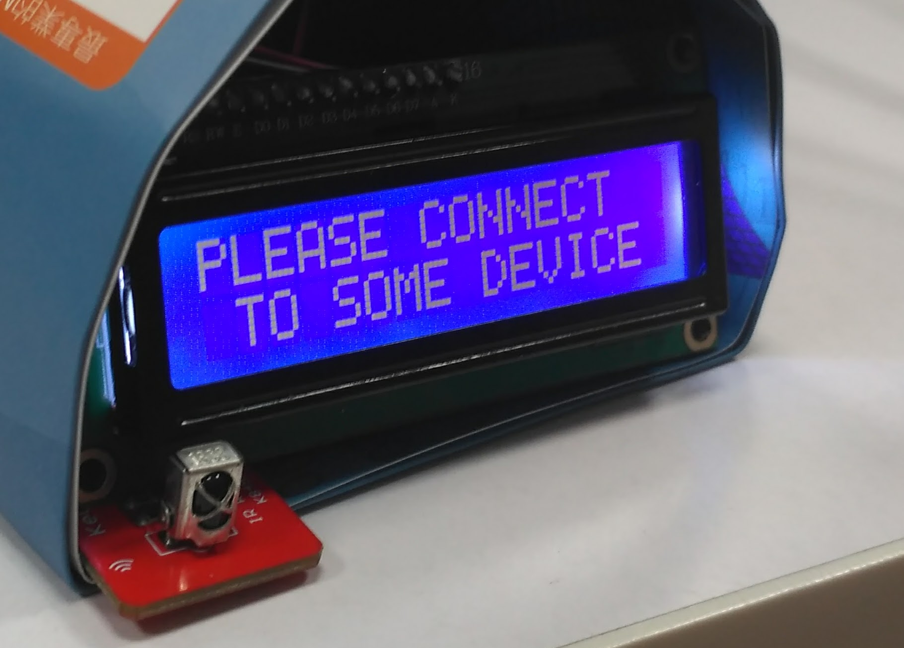

# Bluetooth & IR Controller

## Introduction

This is a controller program for STM32 l476rg SoC to be used as a Bluetooth & IR(Infrared) controller for computer. 
You can use IR remote controller to control your computer, which connected to the board by either bluetooth or USB (via STLink).

* Board: ST Nucleo l476rg
* SoC: STM32 l476rg (ARM Cortex M4, 144k RAM, 1M Flash)

* Preview
  

## Structural diagram

* Design structure: [design.pdf](./doc/design.pdf)

## Hardware

* STM32 Nucleo-64 development board with STM32L476RG MCU
* HC-05 / HC-06 Bluetooth module
* Infrared (IR) receiver
* LCD (16&times;2)


## Develop environment

This repo is a Eclipse project with "AC6 System Workbench for STM32" plugin support.
For detailed description, refer to [STMicroelectronics's website](http://www.st.com/en/development-tools/sw4stm32.html).

## Client program

To perform the requested key events (as well as other special events), 
some client program should run on the target platform. Currently, 
a Python script is provided to be used on Windows platform. 
[Python Script](./python/)

## Communication Protocol

### Device --> Board

* Name

Report the name of the device, which will be displayed on LCD, limited to 11 characters.

```txt
  0x20 [char-00] [char-01] [char-02]
  0x21 [char-03] [char-04] [char-05]
  0x22 [char-06] [char-07] [char-08]
  0x23 [char-09] [char-10] 00

  Each package in 4 bytes only.
  The last byte is ignored.

```

* Connectivity & Type

Transmit the device type and device connectivity. The device will transmit this package
on a regular basis as a *heartbeat*.

```txt
  0xff [Type] 0x00 0xaa
        PC:      0x01
        Android: 0x02
```

* Message

Request to display a message on the LCD. Generally used as a status report or error feedback.
This may not be displayed owing to various reasons.

This string transmitted use a terminator '\0' as C language.

*This was not fully implemented.*

```txt
  0x70 [char-00] [char-01] [char-02]
  0x71 [char-03] [char-04] [char-05]
  0x72 [char-06] [char-07] [char-08]
  0x73 [char-09] [char-10] [char-11]
  0x74 [char-12] [char-13] [char-14]
  0x75 [char-15] 00 00

  The string is limited to 16 characters.
  00 is used as terminator
```

### Board --> Device

For simplicity, all package are 4 bytes.

* Mouse Action

Support a general mouse with 3 buttons (left, right, middle), and a scrollable
middle wheel (scroll up or down one unit each time), and a relative coordination
based positioning method (each movement is represented in one byte in each 
orientation/axis in 2D plane).

*This was not fully implemented.*

```txt
  0x55 [left|right|middle|scrollUp|scrollDown] dX dY
        0x01 Left                           dX: byte
        0x02 Right                          dY: byte
        0x04 Middle (Key press)
        0x08 Middle (Scroll up)
        0x10 Middle (Scroll down)
```

* Key Action

Since the key code is reinterpreted by a Python script in host PC platform,
the action code here are taken directly from PyInput library to maximum the
compatibility.

```txt
  0xaa [Shift|Alt|Ctrl|Win] KeyCode[Python]
         0x01 Shift           0x00   No key
         0x02 Alt             other  Key Code defined in PyKeyboard
         0x04 Ctrl
         0x08 Win
```

* Special Action

The remote controller contains some functions that can be dirrectly mapped to
the functionality of computer such of power of control. These signal are
transmitted in this package. If the daemon script on host has no privilige to
perform the required action, it *may* send a error package to indicate this problem.

```txt
  0xdd [Confirmation] [Delay] [Action]
       0x01 confirmation: a action may require additional confirmation on host PC
                    Delay: (in sec) postpone the actual execution of request script
                              Action Code

  Action Code:
    1 (0x01): shutdown

```

## Display

### Font Mapping

```txt
  [0] Device Icon            => LCD_FONT_PC LCD_FONT_PHONE
  [1] Mouse/Keyboard (left)  => LCD_FONT_MOUSE_L LCD_FONT_KEYBOARD_L
  [2] Mouse/Keyboard (right) => LCD_FONT_MOUSE_R LCD_FONT_KEYBOARD_R
  [3] IR                     => LCD_FONT_IR
  [4] Ctrl                   => LCD_FONT_CTRL
  [5] Alt                    => LCD_FONT_ALT
  [6] Shift                  => LCD_FONT_SHIFT
  [7] Win                    => LCD_FONT_WIN
```

### Display layout/pattern

* Welcome message

```txt
Row1: "Welcome to use  "
Row2: "                "
       ^              ^
       0             15
```

* Waiting for connection

```txt
Row1: "PLEASE CONNECT  "
Row2: " TO SOME DEVICE "
       ^              ^
       0             15
```

* Connected

```txt
Row1: [DT][  name   ] [MS][IR]
      ^   ^         ^ ^   ^
      0   1        11 13  15

Row2: [KEYS][key name][mm:ss]
      ^                ^     ^
      0               11    15

DT:       Device type icon
name:     Device name
IR:       Infared remote controller connection status
MS:       USB mouse connection status
          (Currently, this was temporarily replaced with number lock)
KEYS:     Functional keys toggle status
key name: General key
mm:ss:    Time of running
```

* Display message

Message will be displayed on the first row.
The second is the same as teh connection status.

```txt
Row1: "[   message    ]"
       ^              ^
       0             15
```

* Display option

Display a option as a simulation of dialog in GUI application.

```txt
Row1: "[    prompt    ]"
       ^              ^
       0             15
Row1: "? [  options  ]"
       ^              ^
       0             15

Options section may have different layout according to the type of option.
```